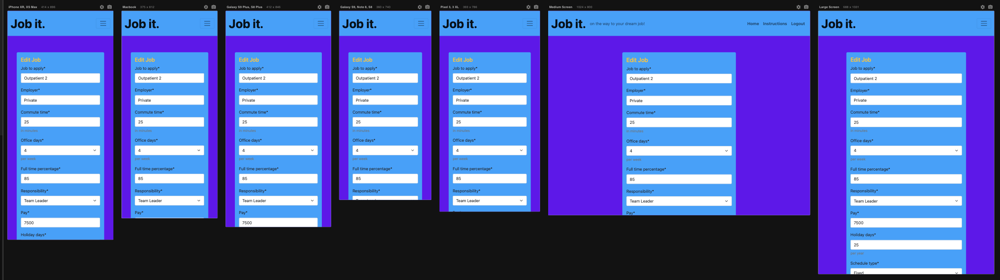
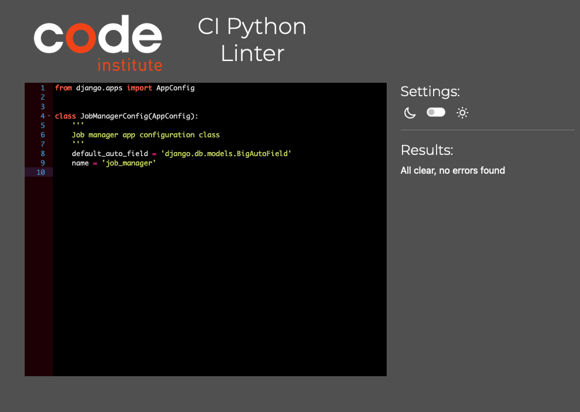

# Job it. | README
 Job Search Management app

*The link to the deployed site [Job it.](https://jobit-e6faad3e8aa6.herokuapp.com/)*

## Overview

The Job Search Management App is a web application designed to help users manage their job search process effectively. It allows users to set up their dream job preferences, track job applications, visualize job matches, and manage application statuses. The app provides a user-friendly interface for organizing and optimizing the job search process, helping users find jobs that best match their preferences.

## Features


### 1. Job Management
- **Add, Edit, and Delete Jobs:** Easily add new job applications, edit existing ones, or remove outdated entries.
- **Dream Job Criteria:** Define your dream job criteria to compare and evaluate potential job opportunities.





### 2. User Authentication
- **Secure User Authentication:** Users can register, log in, and log out securely to manage their job applications.
- **Personalized Experience:** Each user has their own profile and job dashboard for personalized management.


### 3. Match Percentage Calculation
- **Match Percentage:** Automatically calculates the match percentage between each job application and your defined dream job criteria.
- **Ranking:** Jobs are ranked based on how closely they match your dream job, helping you prioritize your applications.


### 4. Responsive Design
- **Mobile-Friendly:** Responsive design ensures a seamless experience across various devices, including smartphones, tablets, and desktops.
- **Optimized UI:** Intuitive user interface for easy navigation and interaction, enhancing usability on all screen sizes.


### 5. Instructional Guidance
- **Instructions Section:** Access helpful instructions and guidance on how to use the application effectively.
- **Onboarding Support:** New users receive onboarding assistance to quickly get started with job management.


### 6. Edit Dream Job
- **Flexible Configuration:** Easily adjust dream job criteria to reflect changing priorities.


### 7. Secure Data Management
- **Data Privacy:** Ensures the privacy and security of user data through robust encryption and access controls.
- **Data Backup:** Regularly backs up user data to prevent loss and ensure continuity of service.


## How to Use

### 1. Adding a New Job to apply

To add a new job that you intend to apply for, follow these steps:

1. Navigate to the "Add Job" page by clicking on the "Add Job" button on the homepage or by visiting the URL `/add_job/`.
2. Fill out the form with the details of the job to apply, such as job title, employer, job description, etc.
3. Click the "Add" button to submit the form.
4. The job will be added, and you will be redirected to the homepage where you can see the list of all your job applications.

### 2. Editing Job  to apply Details

If you need to edit the details of a job  to apply, follow these steps:

1. Navigate to the "Edit Job" page by clicking on the "Edit" button next to the job you want to edit on the homepage.
2. Update the necessary fields in the form.
3. Click the "Edit" button to save your changes.
4. The job details will be updated, and you will be redirected to the homepage.

### 3. Deleting a Job to apply

To delete a job application, follow these steps:

1. Navigate to the "Delete" Job page by clicking on the "Delete" button next to the job you want to delete.
2. Confirm the deletion by clicking the "Delete" button.
3. The job will be permanently deleted, and you will be redirected to the homepage.

### 4. Editing Dream Job Criteria

To edit your dream job criteria, follow these steps:

1. Navigate to the "Edit Dream Job Criteria" page by clicking on the "Edit Dream Job Criteria" button on the homepage.
2. Fill out the form with your desired dream job criteria.
3. Click the "Edit" button to save your changes.
4. Your dream job criteria will be updated, and you will be redirected to the homepage.

### 5. Viewing Instructions

If you need guidance on how to use the application, you can view the instructions by following these steps:

1. Navigate to the "Instructions" page by clicking on the "Instructions" button on the homepage.
2. Read through the instructions provided.

## Development User Stories


#### Create Dream Job Preferences Profile:

As a user, I can create a profile with my dream job preferences so that I can set up my job search criteria.

- AC1: I can specify preferences such as relocation, commuting distance, work-from-home option, salary range, etc.

- AC2: I can save my preferences for future reference.

#### Add Job Profiles:

As a user, I can add job profiles to my profile to track jobs I want to apply to.

- AC1: I can add details such as job title, application deadline, position availability, application link, etc.

- AC2: I can specify criteria for each job profile, matching those of my dream job preferences.

#### Access Job Management Board:

As a user, I have access to a job management board to help with managing job application status.

- AC1: I can track the status of each job application (e.g., applied, interview scheduled, rejected) on a centralized board.

- AC2: I can update the status of each job application as it progresses through the hiring process.

#### View Job Ratings and Visualization:

As a user, I can view an overall automatic rating for each job profile and visualize it in a chart.

- AC1: The job rating is calculated based on the matching percentage between the job criteria and my dream job preferences.

- AC2: The job rating is displayed in a chart along with other relevant information about each job.


## Languages:

- **Python:** Utilized for backend development, including data modeling, business logic, and API endpoints.

- **HTML/CSS:** Used for structuring and styling the frontend user interface to ensure a visually appealing experience.

### Frameworks and Libraries:
- **Django:** A high-level Python web framework used for rapid development, providing robust features for building web applications efficiently.

- **Bootstrap:** Utilized for frontend development to create responsive, mobile-first designs with pre-built components and styling.

- **jQuery:** Leveraged for simplified DOM manipulation and event handling to enhance user interactions and dynamic content loading.

- **Django Crispy Forms:** Integrated to easily render Django forms in a visually appealing and consistent manner, enhancing form usability.

- **Django Rest Framework:** Employed to create RESTful APIs in Django, facilitating seamless communication between the frontend and backend components.

## Dependencies

- **[asgiref==3.7.2](https://pypi.org/project/asgiref/)**: ASGI (Asynchronous Server Gateway Interface) is a specification for building asynchronous Python web applications and servers. `asgiref` provides the base ASGI implementation for Python.
  
- **[dj-database-url==0.5.0](https://pypi.org/project/dj-database-url/)**: This library allows you to utilize the 12factor inspired DATABASE_URL environment variable to configure your Django application.

- **[Django==4.2.11](https://www.djangoproject.com/)**: Django is a high-level Python web framework that encourages rapid development and clean, pragmatic design. It includes built-in features for authentication, URL routing, template engine, and more.

- **[django-allauth==0.57.2](https://pypi.org/project/django-allauth/)**: `django-allauth` is a Django package that provides a set of authentication mechanisms, including social authentication (e.g., OAuth), email confirmation, and account management.

- **[django-crispy-forms==2.1](https://pypi.org/project/django-crispy-forms/)**: Django Crispy Forms allows you to easily build, customize, and control Django forms using CSS classes.

- **[django-extensions==3.2.3](https://pypi.org/project/django-extensions/)**: Django Extensions is a collection of custom extensions for the Django Framework.

- **[django-summernote==0.8.20.0](https://pypi.org/project/django-summernote/)**: Django Summernote is a simple Django application that integrates Summernote, a WYSIWYG editor, into your Django admin interface.

- **[gunicorn==20.1.0](https://pypi.org/project/gunicorn/)**: Gunicorn is a Python WSGI HTTP Server for UNIX. It allows you to run your Django application in a production environment.

- **[oauthlib==3.2.2](https://pypi.org/project/oauthlib/)**: OAuthLib is a Python library for implementing OAuth1 and OAuth2 providers and clients.

- **[psycopg2==2.9.9](https://pypi.org/project/psycopg2/)**: Psycopg is a PostgreSQL adapter for Python. It allows Python code to interact with PostgreSQL databases.

- **[PyJWT==2.8.0](https://pypi.org/project/PyJWT/)**: PyJWT is a Python library that allows you to encode and decode JSON Web Tokens (JWT).

- **[python3-openid==3.2.0](https://pypi.org/project/python3-openid/)**: python3-openid is a Python library for working with OpenID, an open standard for authentication.

- **[requests-oauthlib==1.3.1](https://pypi.org/project/requests-oauthlib/)**: Requests-OAuthlib is an OAuth library for Python Requests.

- **[sqlparse==0.4.4](https://pypi.org/project/sqlparse/)**: SQLParse is a non-validating SQL parser for Python. It provides functions to parse SQL statements and SQL-like syntax.

- **[whitenoise==5.3.0](https://pypi.org/project/whitenoise/)**: WhiteNoise allows your Django application to serve its own static files, making it easy to deploy Django applications on PaaS services like Heroku.


### Standard library imports:

- **django.db**: Provides tools for interacting with the database, including models and querysets.
- **django.urls**: Handles URL routing and patterns within a Django application.
- **django.views**: Contains generic views and class-based views for handling HTTP requests.
- **django.forms**: Provides form handling and validation.
- **django.contrib**: Contains various contributed modules to Django, such as authentication, admin, sessions, and more.
- **django.shortcuts**: Offers shortcuts and helper functions for common tasks in Django views.
- **django.http**: Provides HTTP-related classes and functions, such as request and response objects.
- **django.template**: Handles template rendering and processing.

### Other tools:

[VSCode:](https://code.visualstudio.com/) was used as the main tool to write and edit code.

[GitHub:](https://github.com/) was used to host the code of the website.

[Heroku:](https://id.heroku.com/login) Utilized for deployment and hosting of the web application, providing a scalable platform with integrated continuous delivery and deployment features.

[ElephantSQL: ](https://www.elephantsql.com/) Employed as the PostgreSQL database hosting service, offering a managed cloud database solution for storing and managing application data efficiently.

## Functionality

### Dream Job Matching Functionality

I've implemented a dream job matching functionality using a function inside the job Model. The goal of this function is to match job applications with the user’s dream job criteria and rank them based on how closely they align.

#### Functionality Overview

- **Job Model**: I defined a Django model named `Job` to represent job applications. This model includes various fields such as commute time, office days, responsibility level, etc., each with corresponding choices defined.
  
- **Dream Job Reference**: I added a boolean field `is_dream_job` to indicate whether a particular job application is the user dream job. This reference job serves as the baseline for comparing other job applications.

- **Match Percentage Calculation**: I implemented a method `calculate_match_percentage()` within the `Job` model. This method calculates the match percentage between a job application and the users dream job. It compares each field of the job application with the corresponding field of the dream job, calculates the percentage difference, and then averages these percentages to determine the overall match percentage.

- **Sorting Jobs**: I implemented a Django Meta class to specify the ordering of job applications based on their match percentage. Jobs with higher match percentages are ranked higher in the list, showing the user the most matching overall job applications to prioritise.

## Deployment

1. Clone the repository to your local machine.
2. Install dependencies using pip install -r requirements.txt.
3. Set up your environment variables, including database credentials and Django secret key.
4. Create a new PostgreSQL database on ElephantSQL and obtain the database URL.
5. Configure Django settings to use the PostgreSQL database URL.
6. Run migrations using python manage.py migrate.
7. Create a superuser account using python manage.py createsuperuser.
8. Run the development server using python manage.py runserver.
9. Access the Django admin interface to manage user profiles and job applications.
10. Use Django shell to test model functions and logic without the need for frontend.
11. Ensure proper handling of sensitive information such as passwords and database credentials.
12. Follow best practices for Django project structure, including separating settings into different files and using environment variables.

## Manual Testing


| Test Case Description                                       | Expected Outcome                                    | Pass/Fail |
|-------------------------------------------------------------|-----------------------------------------------------|-----------|
| Access the homepage (`/`)                                   | Homepage with a list of jobs to apply displayed    |    Pass   |
| Access the add job page (`/add_job/`)                      | Form to add a new job to apply displayed           |    Pass   |
| Submit a new job to apply form                              | Job to apply added and displayed on the homepage    |    Pass   |
| Access the edit job page for an existing job (`/edit_job/<slug>/`) | Form to edit the selected job to apply displayed  |    Pass   |
| Submit the edit job to apply form                           | Job to apply edited and changes reflected           |    Pass   |
| Access the delete job confirmation page for an existing job (`/delete_job/<slug>/`) | Confirmation page to delete the selected job displayed |    Pass   |
| Confirm the deletion of the job to apply                    | Job to apply deleted and removed from the list      |    Pass   |
| Access the edit dream job criteria page (`/edit_dream_job/`) | Form to edit dream job criteria displayed          |    Pass   |
| Submit the edit dream job criteria form                     | Dream job criteria updated and changes reflected    |    Pass   |
| Access the instructions page (`/instructions/`)            | Instructions for using the application displayed    |    Pass   |
| Verify all links on the homepage are functional            | Clicking each link takes you to the expected page   |    Pass   |
| Verify all form fields on each page are functional         | Input validation works as expected                  |    Pass   |
| Submit forms with invalid data                              | Appropriate error messages displayed                |    Pass   |
| Check responsiveness of each page                           | Pages display properly on different screen sizes    |    Pass   |
| Add multiple jobs to apply                                  | All jobs to apply are displayed and functional      |    Pass   |
| Pagination is happening when more than 5 jobs               | Pagination links show up when 5 jobs or more |    Pass   |
| Test pagination functionality on the homepage               | Pagination links navigate through pages correctly   |    Pass   |
| Edit dream job criteria with different values               | Changes in dream job criteria reflected correctly   |    Pass   |
| Edit job details with various scenarios                     | Changes in job details reflected correctly          |    Pass   |
| Delete multiple jobs to apply                               | Deleted jobs to apply are removed from the list     |    Pass   |
| Test the search functionality with different keywords       | Relevant jobs to apply are displayed                |    Pass   |
| Test filtering functionality with different criteria        | Jobs to apply are filtered correctly                |    Pass   |
| Test sorting functionality with different parameters        | Jobs to apply are sorted correctly                  |    Pass   |
| Test for any security vulnerabilities                       | No unauthorized access or data breaches             |    Pass   |
| Test for browser compatibility                              | Application functions correctly on major browsers   |    Pass   |


## Resolved bugs

### Debugging the Database

When originally attempting to run migrations or start the Django server, the following error occured:

    '''
    > [!Error]
    django.core.exceptions.AppRegistryNotReady: Models aren't loaded yet.
    '''

During the process of debugging the database-related issues, several solutions were attempted to address the "Models aren't loaded yet" error. Each solution aimed to ensure that database queries were performed at the appropriate time and that Django models were fully initialized before accessing them.


1. **Moving Database Queries into Callable Methods**:
Initially, I tried moving database queries into functions within the models.py file. For example, instead of directly assigning choices to fields, I defined methods to retrieve choices when needed. However, this approach didn't fully solve the problem because Django models weren't fully ready when the models.py file was loaded.

    ```
    class Location(models.Model):
       @staticmethod
       def get_choices():
           return Location.objects.values_list('id', 'choice')
    ```

2. **Reusable get_choices Function**:
   Another attempt was to create a reusable function to get choices for any model class. This function aimed to centralize the logic for retrieving choices. However, it faced the same issue as before because Django models weren't fully initialized at the time of import.

   ```
   def get_choices(model_class):
       return model_class.objects.values_list('id', 'choice')
   ```

3. **Using a Callable Class**:
   To overcome the issue with directly querying the database in functions called at import time, I tried using a callable class. This class, named ChoiceGetter, was instantiated by Django when it was ready to get the choices. However, it caused a new problem where Django expected choices to be an iterable, but it received a callable instead.

   ```
   class ChoiceGetter:
       def __call__(self, model_class):
           return model_class.objects.values_list('id', 'choice')
   ```

4. **Modifying the ChoiceGetter Class**:
   To fix the issue with Django expecting choices to be an iterable, I modified the ChoiceGetter class to return choices as a list or tuple when called. This ensured that the choices were in the correct format for Django's expectations.

   ```
   class ChoiceGetter:
       def __call__(self, model_class):
           choices = model_class.objects.values_list('id', 'choice')
           return list(choices)
   ```

5. **Moving Logic to View or Form**:
   Finally, I realized that forms are processed after all models are loaded in Django. So, I moved the logic of setting choices to the form. This ensured that models were fully loaded before attempting to access them, avoiding issues with models not being ready at the time of import.

   ```
   class JobForm(forms.ModelForm):
       def __init__(self, *args, **kwargs):
           super().__init__(*args, **kwargs)
           self.fields['schedule_type'].choices = get_choices(ScheduleType)
           # Other fields' choices set similarly...
   ``` 

By experimenting with these different approaches and considering the timing of model initialization, eventually the issues were resolved, leading to a stable and functional database implementation.


### Reflection on Project Scope and Agile Development

After two days of struggling with an error loop, I came to the realization that I needed to further reduce the scope of the project. Initially, my `models.py` file was extensive, aiming to cover a wide range of functionalities and options. However, this ambitious approach led to complexities and difficulties in implementation.

The overwhelming moments during this process made me understand the importance and relevance of agile functionality in software development. Agile methodology emphasizes incremental and iterative development, allowing for adjustments and adaptations along the way. 

In response to the challenges faced, I decided to streamline the project and implement functionality progressively. This shift in approach enabled me to focus on the core features and build them out more efficiently. It also helped in maintaining my mental health and avoiding burnout by breaking down the workload into manageable tasks.

The `models.py` code was refactored to prioritize essential functionalities, focusing on the job matching aspect. By doing so, I was able to create a more robust and manageable codebase, ensuring better maintainability and scalability in the long run.

Moving forward, I intend to continue embracing agile principles in my development process, recognizing their role in contributing to the successful and efficient development of applications. This experience has reinforced the importance of adaptability and flexibility in tackling software development challenges.


### Debugging Views.py

In the process of fixing issues in `views.py`, I took a step-by-step approach to solve problems that emerged after going back to an earlier version of our code. I reintroduced and rearranged views one at a time to uncover and fix underlying issues, making sure their logic made sense.

This method allowed me to thoroughly examine how views interact with the `Job` object in our Django app. I faced challenges with views relying too much on each other, causing unexpected problems. Additionally, ensuring data flowed smoothly between views and the `Job` object was tricky, especially during job creation and updates.

The main problem I encountered was with creating the dream job object automatically when a user signs up. Without this object, our app couldn't calculate how well other jobs matched the dream job.

#### Challenges Encountered
1. **Interdependency Errors**: Views relied heavily on each other, causing unexpected issues when making changes.
   
2. **Data Integrity**: Ensuring data moved correctly between views and the `Job` object during job creation and updates was tough.

3. **Logic Flow**: Ensuring views followed a logical order, especially when dealing with user sign-up and dream job creation, required careful planning.

#### Solutions Implemented
1. **Methodical Refactoring**: I carefully reorganized views to reduce their reliance on each other, making the code easier to understand and manage.
   
2. **Improved Error Handling**: I made sure our app handled errors gracefully, giving clear feedback to users when things went wrong.
   
3. **Optimized Data Access**: I worked on improving how our app accesses data, making sure it was efficient and didn't slow things down.
   
4. **Thorough Testing and Validation**: I tested each view extensively to make sure changes didn't cause new problems and everything worked as expected.


### Debugging the Match Percentage Calculation

During the development of my Django application for managing job applications, I encountered an issue with the calculation of the match percentage between the user's job applications and their dream job. The problem was that the match percentage for the dream job was consistently showing as 0% instead of the expected 100%.

To address this issue, I carefully examined the calculate_match_percentage() method in the Job model, which is responsible for calculating the match percentage. After thorough debugging, I identified a logic error in the calculation process.

The root cause of the issue was that the total_percentage variable, which accumulates the match percentage for each field, was being incorrectly incremented inside the loop where it should have been outside. As a result, the match percentage for the dream job was only being calculated for fields where the current job's values differed from the dream job's values, leading to an inaccurate result.

To resolve this issue, I adjusted the logic of the calculate_match_percentage() method to correctly calculate the match percentage for each field and then average them outside the loop. By making this adjustment, I ensured that the match percentage for the dream job is accurately calculated as 100%, indicating a perfect match.

After implementing the fix, the match percentage calculation now works as expected, providing users with accurate insights into how closely their job applications align with their dream job criteria.


## Contributors

Dinis Machado

## Credits

The header and footer in the project are a modified version of the Code institute Django Walkthrough.

## Resources

[Bootstrap5 documentation](https://getbootstrap.com/)

[Django documentation](https://docs.djangoproject.com/en/5.0/)

[Bro Code - Python Full Course](https://www.youtube.com/watch?v=XKHEtdqhLK8)

[Code with Mosh](https://codewithmosh.com)

Code Institute Django Walkthrough Tutorial Project - access restricted to students

## Acknowledgments

A special thank you to the oversight and discussion insight from my Code Institute mentor Juliia Konn

## Verification

I verified all code:

* In Lighthouse
* in the Code Institute CI Python Linter
* In W3C HTML
* In W3C CSS


 
 
 

 
 
 
 
 
